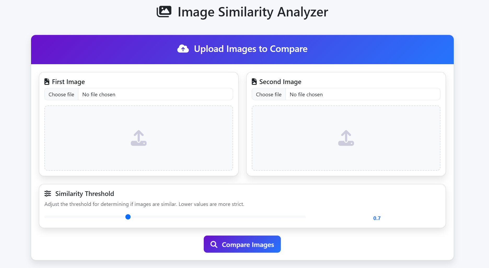

# Image Matching Challenge - CVPR 2025

## Overview
This repository contains our submission to the Image Matching Challenge for CVPR 2025. We've developed a dual-approach system that combines deep learning-based similarity measurement with traditional computer vision techniques to provide robust image matching capabilities.

## Dataset
The dataset for this challenge is available for download at:
[@Kaggle: Image Matching Challenge 2025](https://www.kaggle.com/competitions/image-matching-challenge-2025)

## Model Architecture

### MobileNetV2-Based Embedding Network
Our primary model utilizes a fine-tuned MobileNetV2 architecture with the following enhancements:

- **Pre-trained ImageNet weights** as the foundation
- **Fine-tuned top layers** (last 30 layers unfrozen for training)
- **Embedding layer design**:
  - Global average pooling
  - Dropout regularization (30%)
  - Two dense layers (256 → 128 neurons) with ReLU activation
  - L2 regularization for weight decay
  - L2 normalization for embedding stability

The model is trained using **semi-hard triplet loss**, which effectively learns a metric space where similar images are clustered together while dissimilar images are pushed apart.

### Data Augmentation Pipeline
To improve generalization, we implemented a comprehensive augmentation strategy:
- Random brightness adjustments
- Contrast variation
- Hue and saturation shifts
- Horizontal flips
- Random zoom and rotation

### Training Approach
The training process incorporates:
- Early stopping with patience
- Learning rate reduction when plateauing
- Graceful GPU memory handling with CPU fallback

## Web Application

Our Flask-based web application provides an intuitive interface for image similarity analysis:



### Features
- **Dual analysis methods**: Deep learning model + SIFT feature matching
- **Interactive threshold adjustment** for similarity determination
- **Detailed visualizations**:
  - Keypoint detection
  - Feature matching between images
  - Similarity percentages and distance metrics
- **Responsive design** with Bootstrap and animated transitions

### Technical Implementation
- GPU-accelerated inference with CPU fallback
- Session-based result management
- Asynchronous processing with visual feedback
- SIFT (Scale-Invariant Feature Transform) implementation for traditional CV comparison

## Performance

Our model achieved approximately **30% validation accuracy** on a small, imbalanced dataset. While this may seem modest, it demonstrates effective learning despite:

1. Limited training data
2. Class imbalance challenges
3. High variability in image content

The combined approach of deep learning + SIFT provides complementary strengths:
- The neural network captures high-level semantic similarities
- SIFT identifies specific matching features between images

## Usage

### Requirements
```
tensorflow>=2.5.0
opencv-python>=4.5.3
flask>=2.0.1
matplotlib>=3.4.2
numpy>=1.19.5
tensorflow-addons>=0.13.0
scikit-learn>=0.24.2
```

### Running the Web Application
```bash
python app.py
```
The application will be available at `http://localhost:5000`

### Using the Backend Model Directly
```python
from tensorflow import keras
import numpy as np

# Load model
model = keras.models.load_model('image_similarity_model', compile=False)

# Calculate embeddings for images
img1 = keras.preprocessing.image.load_img('path/to/image1.jpg', target_size=(224, 224))
img2 = keras.preprocessing.image.load_img('path/to/image2.jpg', target_size=(224, 224))
    
img1_array = keras.preprocessing.image.img_to_array(img1) / 255.0
img2_array = keras.preprocessing.image.img_to_array(img2) / 255.0

emb1 = model.predict(np.expand_dims(img1_array, axis=0))
emb2 = model.predict(np.expand_dims(img2_array, axis=0))

# Calculate distance
distance = np.linalg.norm(emb1 - emb2)
similarity = np.exp(-distance / 5.0) * 100  # Convert to percentage
```

## Future Improvements

- Implement hard negative mining for more challenging triplets
- Incorporate attention mechanisms to focus on discriminative regions
- Expand dataset with more diverse image pairs
- Explore ensemble approaches combining multiple backbone architectures
- Implement cross-batch normalization for better feature normalization 